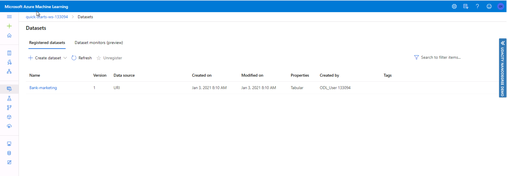
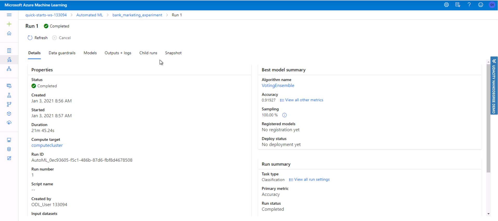
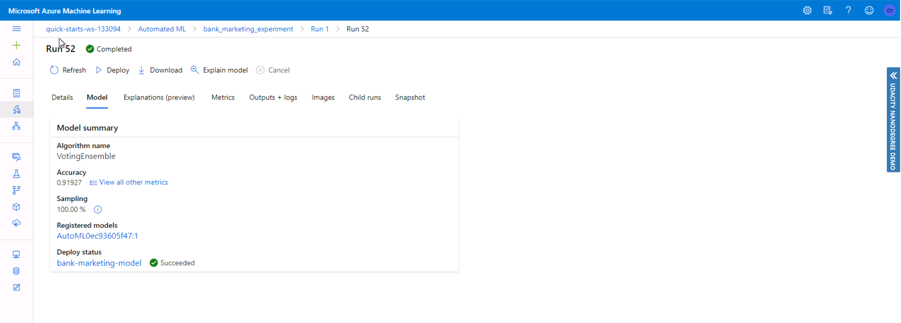
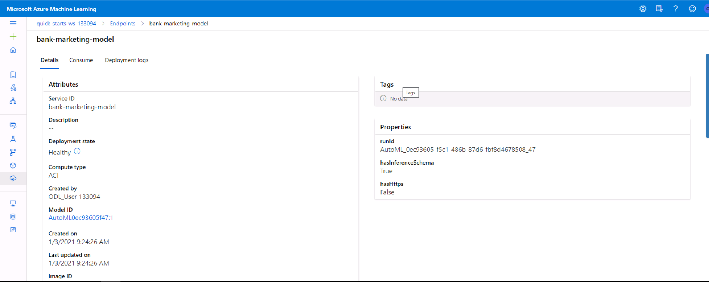
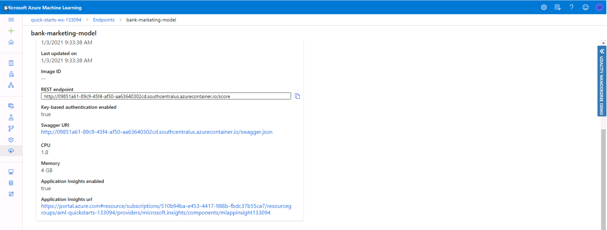
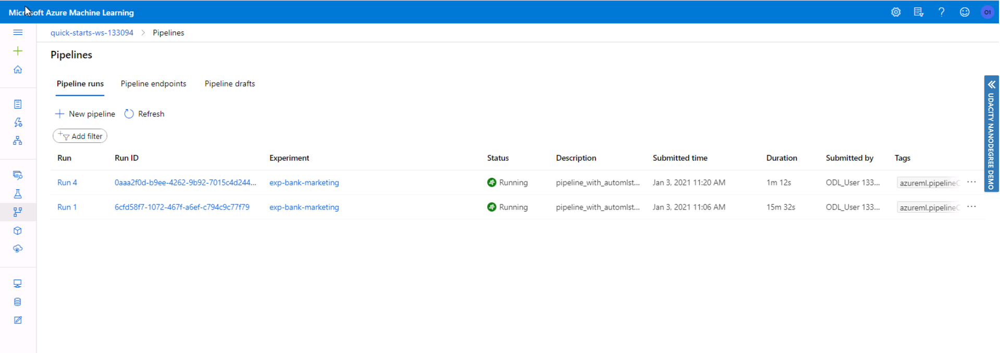

# Operationalizing Machine Learning

## Architectural Diagram

## Key Steps

### 1. AutoML Experiment
Uploading the Bank Marketing Dataset in Azure

Next, we ran AutoML on the Bank Dataset. It took around 22min to train various models.

Finally, we found the best model. The list is sorted in descending order in terms of accuracy.

VotingEnsemble was the best performing model with an accuracy of 91.92%.

### 2. Model Deployment
The next step was to deploy the best model which was VotingEnsemble.

### 3. Enable Logging
The best performing model was deployed using Azure Container Instance (ACI) and authentication was enabled while deploying. We also enabled Application Insights using logs.py file

In the following screenshot we can see application insights is enabled and we also have a url.

We can also check the logs after running the logs.py file

### 4. Swagger
We'll use the serve.py file to serve json file which contains the schema of the REST API through which the model can be called. We have downloaded the swagger.json file from the deployed model.

Calling the REST API from Swagger

### 5. Model Endpoint
After the model has been deployed, we'll use the endpoints.py file to send request to the REST API.

### 6. Create, Publish and Consume AzureML Pipeline
Below is the screenshot that confirms that the AzureML Pipeline was completed the execution successfully.

We can see the details of the pipeline in the endpoints section.

In the below screenshot we can see the pipeline is running

Finally, we can see the details about the completed pipeline along with other details such as rest endpoints

## Screen Recording
https://www.youtube.com/watch?v=1DGpRYac2Bo
